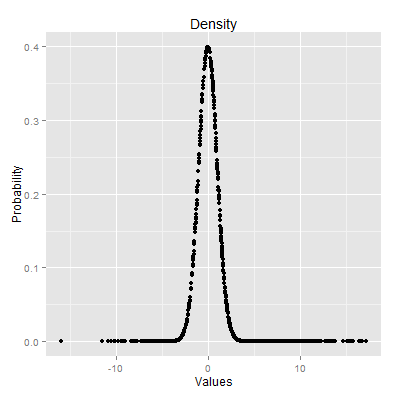

The "Various distributions plots" presentation
========================================================
author: Maciej Nowak
date: 11-November-2015

The goal
========================================================

The purpose of this application is to illustrate how the selected
distributions behave depending on their parameters settings.
As one image is worth one thousand words I decided to show how the
the distribution, its probability density function and its
cumulative probability density function charts change with their parameters change. I chose the following distributions but the application can be easily extended:
- Normal
- Logistic
- Log Normal

The application main screen
========================================================
The application main screen allows us to select the distribution, its parameters and a chart we want to investigate.

An example chart
========================================================

For 905 observations, "Normal" distribution with mean = 3 and sd = 5 and "Density" chart we would see:
 
Final comments
========================================================
This application can be considered as a base for a future educational product that would enable students to explore various distributions and easier understand what the implications of parameter changes are. Obviously further development would be needed and the interface would have to be modified to accommodate various distributions.
